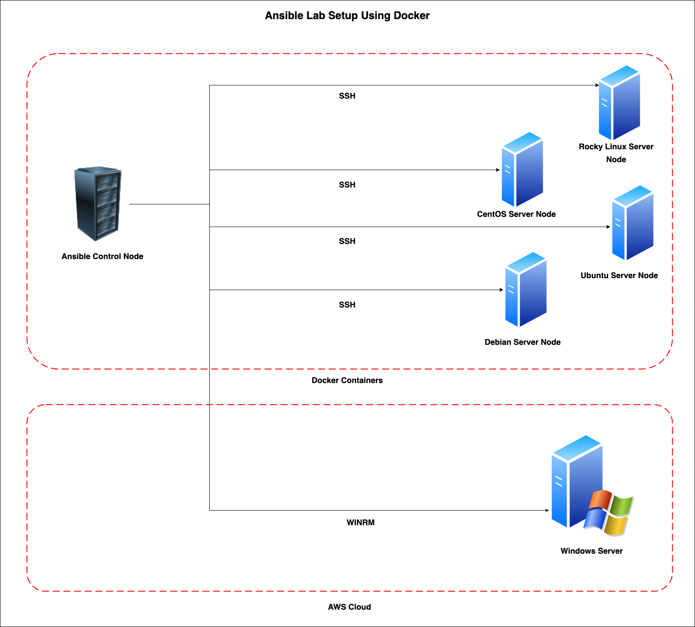

# Mastering-Ansible
Let's mastering the ansible concepts.

## Installation :

* Rocky Linux OR CentOS

```
sudo yum install epel-release
sudo yum install ansible
```

* Fedora 

```
sudo dnf install ansible
```

* Ubuntu OR Debian

```
sudo apt update
sudo apt install software-properties-common
sudo add-apt-repository --yes --update ppa:ansible/ansible
sudo apt install ansible
```

* Python Based  

```
python3 -m pip install --user ansible

OR 

python3 -m pip install --user ansible-core==2.12.3
```

## Lab Setup :

### Lab Architecture Diagram :



### Lab Requirements :

1. Docker 
2. Docker-Compose

### Run Lab Setup :

```
docker compose up -d 

docker exec -it ansible-node /bin/bash
```

### Lab Server Details

| Server Name      | Server IP  | OS           | Username |
|------------------|------------|--------------|----------|
| Ansible Node     | 10.10.0.2  | Rocky Linux  | root     |
| Rocky Linux Node | 10.10.0.11 | Rocky Linux  | root     |
| CentOs Node      | 10.10.0.12 | CentOS 7     | root     |
| Ubuntu Node      | 10.10.0.13 | Ubuntu 22.04 | root     |
| Debian           | 10.10.0.14 | Debian 11    | root     |

## Meetups :

* Meetup #1 (25/02/2023) - `Ansible Community Day` at [RedHat, Pune](https://www.redhat.com/en)
    * [My Talk : Ansible 101 - Hands-on](./slides/Ansible_101.pdf)
    * Hands-On Labs :
        * [Lab #1](./labs/lab-1.md)
        * [Lab #2](./labs/Lab-2/lab-2.md)
        * [Lab #3](./labs/Lab-3/lab-3.md)
        * [Lab #4](./labs/Lab-4/lab-4.md)
        * [Challenges](./labs/challenges.md)
    * [Meetup - Photos]

## Cheat Sheet :

* [Ansible CLI Cheat Sheet By Edureka](./cheatsheets/Ansible-Cheat_Sheet_Edureka.png)